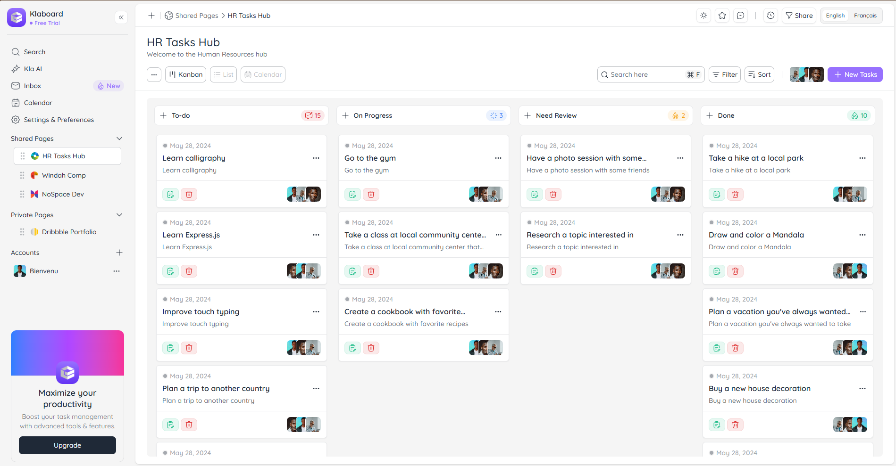

# Klaboard

Klaboard is a React + Vite + Redux Toolkit application designed as a task manager.  
It includes features such as a Kanban board, calendar view, CRUD operations, i18n, dark mode, and unit/component test coverage.

---

## 📋 Prerequisites

- Node.js v18 or v20 (recommended)
- npm v9+ (comes with Node)
- Git

---

## 🚀 Getting Started

### Clone the repository

```bash
git clone https://github.com/Bien-venu/klaboard.git
cd klaboard
```

### Install dependencies

```bash
npm install
```

### ⚙️ Environment Variables

Create a `.env` file in the project root with:

```env
VITE_API_URL=https://dummyjson.com
```

This variable is required for API calls in development and testing.

---

## 🖥️ Running the App Locally

Start the development server:

```bash
npm run dev
```

By default, the app is available at: http://localhost:3000 


---

## 🧪 Running Tests

The project uses Jest with React Testing Library.

Run all tests:

```bash
npm test
```

Run tests with coverage:

```bash
npm test -- --coverage
```

Run a specific test file:

```bash
npm test -- src/components/__tests__/AddTodo.test.tsx
```

---

## 🛠️ Build for Production

Create a production build:

```bash
npm run build
```

This outputs optimized static files into the `dist/` folder.

Preview the production build locally:

```bash
npm run preview
```

---

## ✅ Testing Notes

- Tests are written at Unit & Component level to showcase testing skills.
- Components are wrapped with required providers (Redux Provider, ThemeProvider, i18n mocks) in tests.
- Jest DOM matchers (e.g., `toBeInTheDocument`, `toBeVisible`) are available via `@testing-library/jest-dom`.

---

## 📦 Deployment

- Ensure `.env` contains `VITE_API_URL=https://dummyjson.com`
- Run `npm run build`
- Serve the contents of the `dist/` folder with any static file server (e.g., Netlify, Vercel, or your own Node/Express server).

By default, the app runs on port 3000.

---

## 🔍 CI Integration

GitHub Actions workflow is included to run tests automatically on Pull Requests.  
See `.github/workflows/test.yml` for configuration.

---

## 📸 Screenshot

